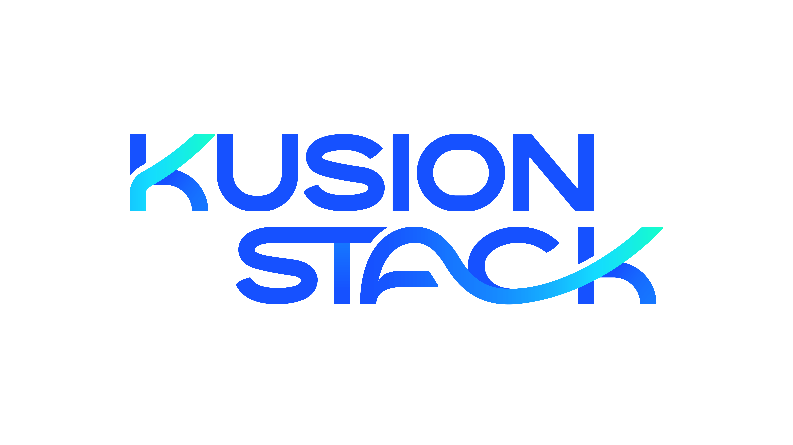
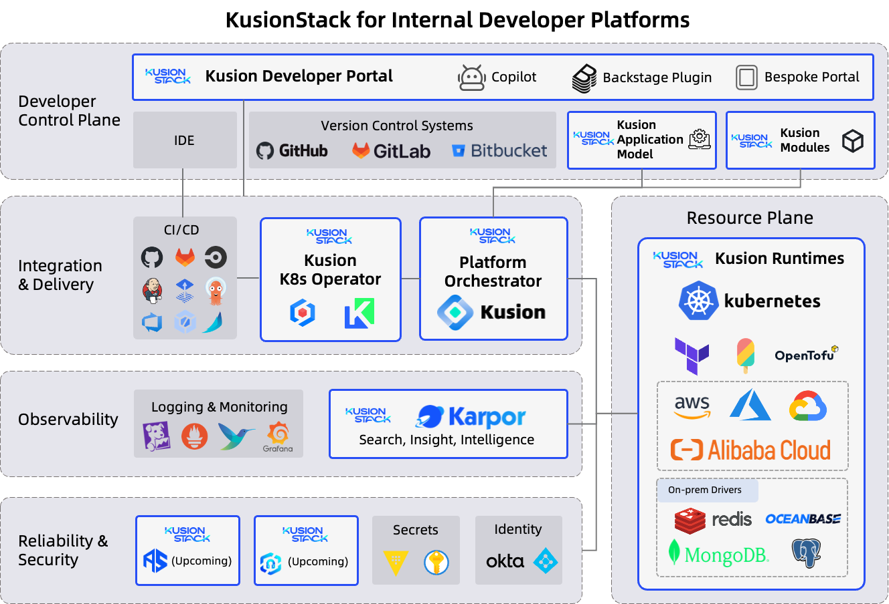

# KusionStack - Open Teck Stack for IDP

## What is KusionStack?

KusionStack is an open-source tech stack designed to empower platform teams in developing production-ready, self-service [Internal Developer Platforms](https://internaldeveloperplatform.org/) (IDPs). It provides a comprehensive set of modular components that teams can use to build every layer of their IDPs. These components are both composable and programmable, offering the flexibility to use them as a complete IDP solution or to integrate specific elements into your existing IDP through extensive APIs. Whether you're building from the ground up or enhancing what you have, KusionStack offers the tools to streamline the process.

* [Kusion](https://github.com/KusionStack/kusion) - Intent-Driver Platform Orchestrator
* [Karpor](https://github.com/KusionStack/karpor) - Intelligence for Kubernetes
* [Kuperator](https://github.com/KusionStack/operating) - Automation application delivery on Kubernetes
* More to come...

## Building Blocks

## Blogs and Representations

* [Modeling application delivery using AppConfiguration](https://medium.com/@kusionstack/modeling-application-delivery-using-appconfiguration-d291830de8f1)
* [How to operate applications at scale in the era of Post Cloud Native?](https://medium.com/@kusionstack/how-to-operate-applications-at-scale-in-the-era-of-post-cloud-native-e2a7e08dfad4)
* [Deep dive: Delivering and managing an LLM Agent application with KusionStack](https://platformcon.com/workshops/deep-dive-delivering-and-managing-an-llm-agent-application-with-kusionstack)
* [Weaving intents into reality: Defining your own intent-driven golden path](https://platformcon.com/speakers/zibo-he)
* [Deliver WordPress with KusionStack on Kubernetes and Clouds within just 5 minutes](https://www.youtube.com/watch?v=QHzKKsoKLQ0)
* [Accelerating innovations across Internet and Financial Services via Platform Engineering at AntGroup](https://www.youtube.com/watch?v=IAd5IonlEtM)

## Adopters

Please refer to [USERS](USERS.md) to see list of adopters.

## Contributing

To learn about how to contribute to KusionStack, see our [contributing documentation](CONTRIBUTING.md). KusionStack contributors must follow the [CNCF Code of Conduct](https://github.com/cncf/foundation/blob/main/code-of-conduct.md).

Each KusionStack sub-project might maintains its own contributing guide. Those lists are available in the respective project repositories:

* [Kusion](https://github.com/KusionStack/kusion/blob/main/CONTRIBUTING.md)
* [Karpor](https://github.com/KusionStack/karpor/blob/main/CONTRIBUTING.md)

## Project Resources

- KusionStack Github: [https://github.com/KusionStack](https://github.com/KusionStack)
- KusionStack website: [https://www.kusionstack.io/](https://www.kusionstack.io/)
- KusionStack Slack: [Join](https://join.slack.com/t/kusionstack/shared_invite/zt-19lqcc3a9-_kTNwagaT5qwBE~my5Lnxg)
- KusionStack Twitter: [KusionStack](https://twitter.com/KusionStack)